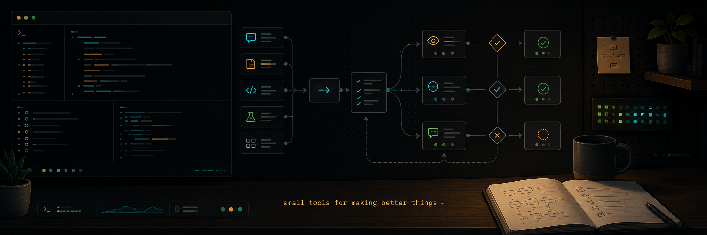

# Skills



These are my agent skills.

That sounds more formal than it is. Really, this is the pile of prompts,
checklists, helper scripts, and tiny workflows I kept reaching for while trying
to build useful things with agents and still keep the work sharp.

If I ask an agent to do something once, fine. If I ask it twice, maybe I am
being lazy. If I ask it three times, something is up. Usually the answer is one
of:

1. write a skill;
2. write a script;
3. admit the workflow is wrong.

This repo is mostly the first two.

It is personal in the same way a dotfiles repo is personal. The details reflect
how I like to build, review, and ship. But the shape is useful beyond my setup:
give the agent real context, make the work legible, hand off the parts that can
run on their own, and stand at the end of the loop as the bar nothing ships
past until it is actually good.

AI has not deleted software engineering. It has moved a lot of the typing
somewhere else and made the review problem much, much sharper. These skills are
the rails I use to stay on the right side of that.

## The Loop

The skills snap together into the loop I actually run:

1. **Find the thing.** Use `session-recall`, `review-surface-map`, or
   `diagnose` to recover context, map a messy change, or chase a bug until it
   becomes concrete.
2. **Brief the agent.** Use `grill-with-docs` to pull repo docs, code, Obsidian
   specs, and tickets into the conversation before the agent starts guessing.
   Use `research` when the missing context lives in primary sources outside the
   current repo.
3. **Make it grill me.** Use `grilling`, or `grill-with-docs` when project
   context matters, until the missing decisions are obvious.
4. **Turn the conversation into a spec.** Use `to-spec` to freeze the plan in
   Obsidian `Specs/`, and `to-tickets` when the work needs to become
   blocker-aware Obsidian `Issues/`.
5. **Map it if it is too big.** Use `wayfinder` for foggy work that will not fit
   in one session.
6. **Hand off and let it run.** Use `handoff` for a clean session and
   `parallel-slice-orchestration` when several isolated worktrees should move
   at once.
7. **Talk to it. Test it.** Use `test-audit`, `frontend-ui-validation`, and
   `diagnose` to prove the thing works instead of trusting the transcript.
8. **Review it like I hate it.** Use `code-review`, `review-until-clean`,
   `cold-pr-review`, `cold-pr-review-until-clean`, `finding-discipline`,
   and `pr-rubbish-audit`.
9. **Ship it.** Use `pr-proof-pack`, `monitoring-gh-actions`, and
   `review-guardrails` to make the evidence, CI state, and review loop
   readable.
10. **Bonus: point it at the changelog and tell it to break things.** Findings
   from that usually go straight back through `diagnose`, `handoff`,
   `test-audit`, and `code-review`.
11. **Rinse, repeat, profit.** Use `skill-cleaner` when the loop itself starts
    getting noisy.

None of this is sacred. Half the specific commands will probably be obsolete
soon enough. The point is the shape: notice what keeps helping, turn it into a
skill or script, keep the loop legible, and raise the bar at the review end.

## What Is In Here?

- **Review and quality loops:** `code-review`, `review-until-clean`,
  `cold-pr-review`, `cold-pr-review-until-clean`, `finding-discipline`,
  `review-surface-map`, `review-guardrails`, and `pr-rubbish-audit`.
- **Testing and implementation discipline:** `test-audit`, `tdd`,
  `typescript-discipline`, `reducing-cognitive-load`, and `diagnose`.
  `tdd` is still here as a supporting implementation discipline
  for handoff/orchestration workflows, not because I usually call it directly.
- **Frontend work:** `frontend-ui-validation` and
  `acpx-frontend-delegation`, with `external.md` documenting the Impeccable
  install path.
- **Planning and handoff:** `grilling`, `grill-with-docs`, `research`,
  `to-spec`, `to-tickets`, `wayfinder`, `parallel-slice-orchestration`,
  `handoff`, and `session-recall`.
- **Project-specific skills:** `skills/openclaw/` contains OpenClaw-specific
  workflows. They are grouped there so the public repo stays legible, but they
  still install by skill name.
- **Meta tools:** `skill-cleaner` audits loaded skills, duplicates, unused
  candidates, and prompt-budget pressure.
- **Local helpers:** `code-review` includes the Rust `review-findings` CLI for
  durable review findings, verification records, semantic-ish local search, and
  CLI-backed closeouts. Install it with
  `skills/code-review/scripts/install-review-findings`.

## Credits

Some of this started somewhere else.

Matt Pocock's agent workflow ideas shaped the `grill`, PRD, slicing, and
handoff parts of the loop. Peter Bakaus's Impeccable work shaped the frontend
design and review path. This repo does not vendor Impeccable; `external.md`
documents the pinned install path and `frontend-ui-validation` handles rendered
proof.

As usual, I took the shape, bent it around my own setup, and kept the parts
that paid rent.

## Install

Clone the repo, then ask your agent to read `INSTALL.md` and install the
skills for its current harness.

The install model is deliberately boring:

- the harness skills directory stays a real directory;
- each repo skill is linked into it as its own symlink;
- skill names come from `SKILL.md` frontmatter, not folder paths;
- local hand-written skills are preserved unless the user explicitly approves
  replacing them;
- third-party skills are installed only through the pinned commands in
  `external.md`.

That gives you a normal repo you can pull, review, and update without turning
your whole skills directory into a mystery symlink.

## Verify

Run:

```sh
./tests/skills-test
./tests/review-findings-test
```

The tests check skill frontmatter, handoff tmux helper behavior, and the
review-findings CLI lifecycle. CI also checks shell, Python, JavaScript, and
Rust helper syntax/builds.

## License

MIT, with bundled third-party assets retaining their own notices.

## Public Snapshot

This repository was published as a clean snapshot rather than a mirror of the
private workspace it came from. The goal is to keep the useful workflows public
without carrying private history, local machine paths, credentials, or old
vendor/submodule baggage along for the ride.

Personal and opinionated does not mean secret. Workflow stays. Leaks do not.

## Security

If you find a secret, unsafe install behavior, a private path that should not
be public, or a helper script that can mutate a user's machine without clear
consent, please use GitHub private vulnerability reporting. See `SECURITY.md`.
