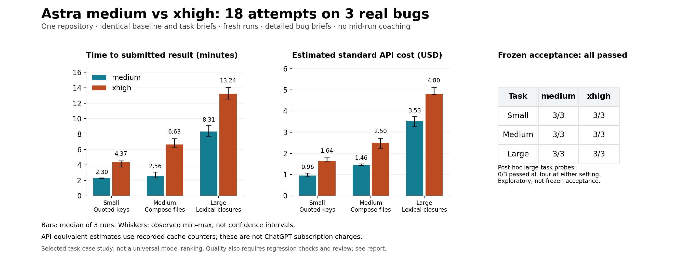

# Astra medium versus xhigh on three real Uplinked bugs

September 11, 2026 · 18 fresh attempts · 3 repeats per task and setting

## What happened

**Medium was faster and cheaper on every paired attempt. Both settings passed every frozen acceptance check.** This is a small, diagnosis-assisted case study, not evidence that the settings have equal quality or that medium always wins.

| Task | Medium time | Xhigh time | Medium API estimate | Xhigh API estimate | Frozen acceptance |
| --- | ---: | ---: | ---: | ---: | ---: |
| Small | 2m 18s | 4m 22s | $0.96 | $1.64 | 3/3 each |
| Medium | 2m 34s | 6m 38s | $1.46 | $2.50 | 3/3 each |
| Large | 8m 19s | 13m 15s | $3.53 | $4.80 | 3/3 each |

Times and costs are separate medians of three runs, not necessarily the same run. Prices are **standard API-equivalent estimates in USD**, not subscription charges. All 18 attempts are included in [results.csv](results.csv).



## The three problems

These were researcher-selected, reproduced bugs on the same private Uplinked revision. Size labels describe relative scope, not an external difficulty rating.

| Task | User/operator-visible failure before the fix | Frozen checks | Baseline |
| --- | --- | ---: | ---: |
| Small: quoted JSON keys | A valid filter path containing consecutive periods inside a quoted key is marked invalid. | 15 validation/parsing cases, including escaping and invalid paths | 11/15 |
| Medium: Compose metadata | Stack inventory loses Compose override/environment files and can change their precedence when forming reclaim commands. | 8 checks through the actual Docker CLI formatter against a synthetic local Engine endpoint | 2/8 |
| Large: lexical closures | A valid export expression is mistaken for recursion when nested scopes reuse a function name; both editor validation and backend evaluation reject it. | 3 valid closure variants and 3 genuine-recursion negatives, each checked at editor and backend boundaries | 3/6 |

After submission, all attempts scored 15/15, 8/8, or 6/6 on their respective frozen checks. The Docker fixture never ran a live daemon lifecycle operation. The expression checks called exported product functions, not a mock evaluator. There was no full browser or deployed application test.

## Experimental design

- Model: `gpt-6-astra`, requested `medium` or `xhigh`; Codex CLI 0.153.4. The alias and backend hardware could not be pinned to an immutable model snapshot.
- Source: one baseline commit, `d07035cadff80fc2c3865ad83f22fce55f4ed624`. Every attempt received a fresh dedicated Git worktree and ephemeral session.
- Six cells: three tasks × two settings, with three stochastic repeats per cell. Runs were sequential, not competing benchmark workers. Task order was shuffled with seed 20260911; setting order alternated by task/repeat. With three repeats, order is necessarily imperfectly balanced.
- Identical brief within each task: reproduction, likely owner files, required preserved behavior, available commands, and environment limits. These are **diagnosis-assisted repairs**, not independent discovery or open-ended product development. No mid-run coaching or cross-attempt feedback was provided.
- Nested subagents and web search were disabled. User configuration was ignored; memory use/generation disabled. Repository instructions remained available. No new dependencies or live-service access were allowed.
- Bun 1.3.14 and Node 24.20.0 on one Linux host. Frozen dependency restore with lifecycle scripts ignored. Bun differed from the repository's declared 1.4 version, equally for both settings.
- Task briefs, acceptance fixtures and grading code were frozen before measured runs. SHA-256 commitments are retained in [provenance.json](provenance.json) and [protocol.json](protocol.json). Freeze was local, not an externally timestamped preregistration.
- Elapsed time runs from CLI process start to exit: model generation, tool execution, reads, local tests and in-run repair are included. Discovery, setup, connectivity preflights, post-run grading/review and report preparation are excluded.
- Time limits were 15/25/40 minutes by task. No run timed out; every run exited zero and reported complete usage. No attempts were dropped or restarted. An agent could iterate on its fix within its one timed attempt; this is not a first-patch success metric. CSV nonzero-command counts include expected red tests, no-match searches and tool/setup errors; they are not counts of failed fixes or a measured rework score.

## Quality checks beyond the frozen suite

Two fresh Astra-medium reviewers were given run IDs, task briefs, source/test diffs and repository guidance, but no effort labels, timing, token counters or prior verdicts. They reviewed all 18 attempts. Small and medium source review found no supported introduced defect; this is not proof of absence. Three small production diffs were byte-identical, which was disclosed.

Large-task review found four related cases beyond the frozen suite. The coordinator then ran all four against every large-task attempt and the baseline without repairing any attempt. These **post-hoc, reviewer-discovered probes** are exploratory, not an unbiased held-out score:

- **A — Captured alias:** a safe function alias captured before rebinding must still return the expected value at both boundaries.
- **B — Dependency ordering:** a caller-local name must not hide a captured transform dependency that has not been computed yet; return the dependency-order diagnostic, not a blank export cell.
- **C — Recursion policy:** a reachable recursive call followed by rebinding the function name to a scalar must still be explicitly rejected as recursion. An incidental stack-overflow error does not satisfy that policy.
- **D — Sequential rebinding:** safe same-frame rebinding must not invent a call cycle by combining functions from different points in execution.

| Run | Setting | A | B | C | D |
| --- | --- | --- | --- | --- | --- |
| r05 | xhigh | Pass | Pass | Pass | Fail |
| r06 | medium | Fail | Fail | Fail | Pass |
| r07 | medium | Pass | Fail | Fail | Pass |
| r08 | xhigh | Pass | Fail | Pass | Fail |
| r15 | xhigh | Pass | Pass | Fail | Pass |
| r16 | medium | Fail | Fail | Pass | Fail |

**Every large-task attempt failed at least one supplemental probe.** Xhigh passed more of these selected cases, but that is not a general quality score: the cases were chosen after code inspection, share causes, and come from one task. None of these patches is certified ready to merge.

Baseline attribution matters. A was already broken in backend execution. B exercises newly supported lexical behavior with an existing dependency-order contract. C is a demonstrated regression: baseline explicitly rejected it. For D, baseline editor validation accepted it, but baseline backend execution already overflowed; this is an editor regression and unresolved safe-binding behavior, not a newly broken previously successful export. Other baseline-broken alias cases were rejected as new-regression claims.

Private evidence retains full inputs, boundary outputs and reviewer findings; [posthoc.csv](posthoc.csv) publishes only the per-case results. No supplemental result changed the frozen 18/18 acceptance score or the original measured costs. Additional repair cost and time were **not measured**, so submitted-result cost must not be confused with cost to a robust, reviewed fix.

All 18 post-run focused regression commands passed. Baseline and all 12 small/large shared-package typechecks also passed. Small runs had 28–37 subject-authored common tests; medium had 10–12 stack tests; large had 82–96 tests in the two selected backend suites. The large run with 82 also added a separate 10-test suite, which passed. Counts differ because agents chose their own additional coverage; **more tests are not a quality score**.

The web DOM suite was blocked before the experiment by missing native canvas bindings after scripts-free restore. It is excluded for both settings; pure editor validation still ran. Review and focused tests do not certify full UI behavior, full-repository type safety, production safety, or merge readiness. Experimental patches remain local and unchanged.

## Token accounting and cost

Token counters are aggregate over an entire multi-request agent run. An input total above one million does **not** mean a single million-token prompt: successive requests can resend cached context. The CSV preserves input, cached input, cache-write input, total output, and reasoning-output counters separately. All recorded cache-write counts were zero. Reasoning is already part of output; it is not charged twice.

| Task | Setting | Median input | Median output | Reasoning subset | No-cache cost estimate |
| --- | --- | ---: | ---: | ---: | ---: |
| Small | medium | 392,265 | 3,314 | 212 | $4.09 |
| Small | xhigh | 762,761 | 6,542 | 1,979 | $7.91 |
| Medium | medium | 637,805 | 3,703 | 552 | $6.56 |
| Medium | xhigh | 1,181,238 | 10,797 | 4,732 | $12.35 |
| Large | medium | 1,883,964 | 12,410 | 3,417 | $19.39 |
| Large | xhigh | 2,638,230 | 21,767 | 10,908 | $27.40 |

[Official Astra pricing](https://developers.openai.com/api/docs/models/gpt-6-astra), checked September 11: per million tokens, $10 uncached input, $1 cached input, $12.50 cache writes, $50 output. The estimate is:

```text
USD = ((input - cached - cache_write) × 10
       + cached × 1 + cache_write × 12.5 + output × 50) / 1,000,000
```

The no-cache estimate charges all observed input at $10/M, leaving output unchanged. It is a pricing sensitivity calculation, **not a measured uncached run**; removing caching could also change latency. Actual server cache state was not reset. Input cache fractions and all per-run counters are available in the CSV.

The aggregate CLI events do not expose per-request prompt length or billing tier. Estimates assume standard short-context rates throughout. Requests above 272K input tokens have higher published rates; Fast, Flex and Batch also have different prices. We cannot reconstruct an actual invoice from these counters, measure ChatGPT plan quota, or assign subscription cost to a run. The two settings used the same launch configuration apart from effort and isolated path.

### The “cost per hour” trap

For the same nine submitted tasks:

| Setting | Total elapsed | Total API-equivalent estimate | Estimate per elapsed hour |
| --- | ---: | ---: | ---: |
| Medium | 40m 02s | $17.90 | $26.83 |
| Xhigh | 72m 52s | $27.26 | $22.44 |

Xhigh's estimated spend per elapsed hour is **16.3% lower**, while its total estimated spend is **52.3% higher** and elapsed time **82.0% longer**. A slower run can consume less per hour while costing more to submit the same task set; neither set of large-task submissions passed all supplemental checks. This illustrates the ambiguity in the [Reddit reasoning-usage theory](https://www.reddit.com/r/codex/comments/1wbdcqz/astra_reasoning_usage_theory/); it does not validate or refute its subscription-quota claim.

Across all 18 measured attempts: **22,781,345 input tokens**, including **21,280,000 cached input**; **177,308 output tokens**, including **64,729 reasoning tokens**. The total standard API-equivalent estimate is **$45.16**, excluding experiment setup, discovery, grading and review.

## Variation and paired comparisons

| Task | Setting | Observed time range | Observed API-estimate range |
| --- | --- | ---: | ---: |
| Small | medium | 2m 16s–2m 19s | $0.92–$1.08 |
| Small | xhigh | 3m 45s–4m 31s | $1.64–$1.80 |
| Medium | medium | 2m 19s–3m 05s | $1.44–$1.51 |
| Medium | xhigh | 6m 20s–7m 25s | $2.25–$2.72 |
| Large | medium | 7m 44s–9m 08s | $3.27–$3.74 |
| Large | xhigh | 12m 33s–14m 03s | $4.79–$5.12 |

Each xhigh run took longer and had a higher estimated task cost than its same-task/same-repeat medium partner: 9/9 pairs. Across pairs, time ratios were 1.37–2.73× and cost ratios 1.28–1.89×. Chart whiskers show min–max, **not confidence intervals**. Repeats on the same three selected tasks are not nine independent sampled problems; no significance test or universal ranking is claimed.

## What this supports—and what it does not

This sample supports keeping medium as a cost-conscious starting point for **well-specified repairs like these**, with extra verification where semantics are subtle. It does not measure the benefit of increasing effort after a failed attempt, underspecified architecture work, agent trees, Luna, Sol, multi-agent coordination, or end-to-end delivery through a merged PR.

The large task was the broadest of this set, but every frozen test passed at both settings. That ceiling limits what this benchmark can tell us about genuinely harder work. An independent reviewer may still miss shared bugs, and post-hoc cases must not be relabeled as preregistered outcomes. The same model family reviewed the code; no independent human quality adjudication was performed.

The private source, exact task prompts, patch contents and raw transcripts are retained locally, not included in this publication. Published numeric results and cost arithmetic are auditable, but **the full product experiment is not independently reproducible from this public bundle**. Hashes identify retained records; they do not by themselves prove execution or prevent researcher selection bias.

The related model-tree and completion-instruction ideas remain untested by this experiment. No global model defaults, skill files, worktree launchers, live installation, or repository archival state changed as part of this report.

## Files

- [Every attempt and raw counters](results.csv)
- [Exploratory post-hoc probe outcomes](posthoc.csv)
- [Frozen experimental protocol](protocol.json)
- [Input and private-output hash commitments](provenance.json)
- [Shareable PNG](comparison.png) and [SVG](comparison.svg)
- [Twitter draft](twitter-draft.md), prepared for Jesse to post; nothing posted automatically
