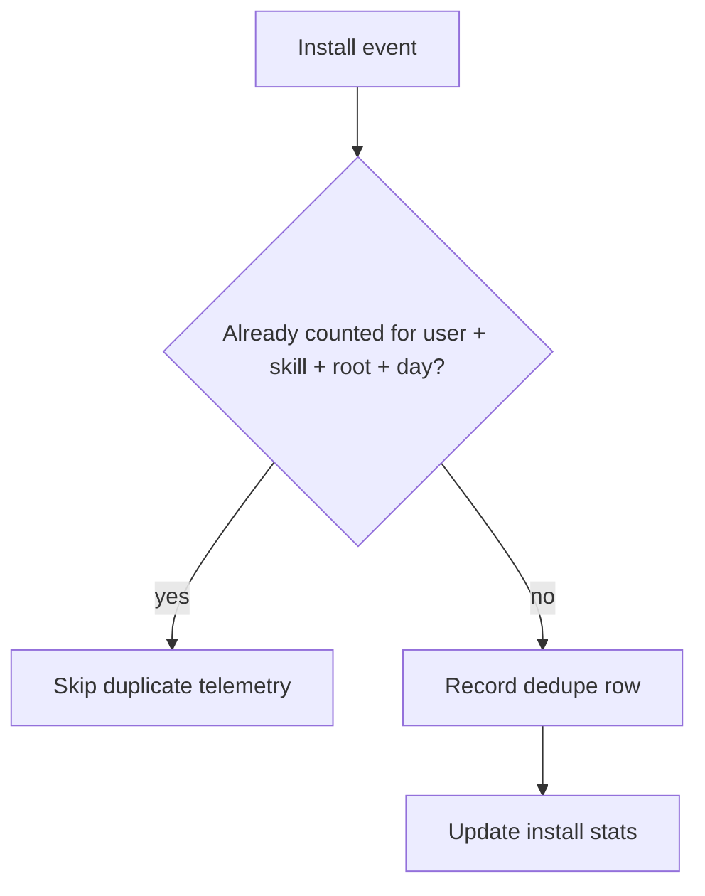
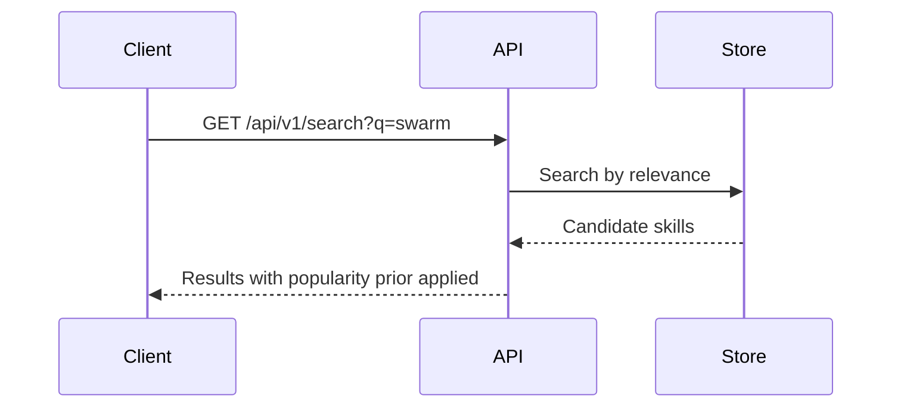

# PR Proof Pack

Use this before creating or updating a PR body, and again after any
meaningful branch change.

The goal is a PR description that a reviewer can understand months later:
what changed, why the proof exists, and how to check it.

## Self-Contained Reader Contract

Write for a reviewer who has not seen the Codex thread, planning notes,
decision log, bug-bash shorthand, local branch history, or private chat
context. Every claim in the PR body must be understandable from at least one of
these sources:

- the net diff from PR base to `HEAD`
- linked public or repo-visible issues, specs, tickets, or docs
- the PR body itself

If a label, task ID, bug-bash code, sprint name, internal nickname, or thread
shorthand matters, either link to a repo-visible source and explain the concrete
behavior in plain language, or omit the shorthand. For example, do not write
"B08-B13 staging bug-bash gaps" unless the PR also links and explains what
those items are. Prefer "server-side validation now rejects invalid phone,
email, date-of-birth, and document-expiry payloads before persistence."

Do not import context from the working session into the PR body. Avoid Codex
thread references, decision-log IDs, unstated Jira state, local-only file paths,
and review-process lore unless they are required proof and explained in terms a
repository reviewer can verify.

## Required Net-Diff Pass

Before writing or updating a PR body, run the bundled script from this skill
directory:

```text
python3 <skill-dir>/scripts/pr_net_diff.py --markdown
```

For a narrow area:

```text
python3 <skill-dir>/scripts/pr_net_diff.py --markdown src/routes/skills/index.tsx convex/telemetry.ts
```

Use this output as source of truth. Describe the net diff from the PR base to
`HEAD`, not the latest commit or branch history.

Do not describe files listed under `Branch-Only Churn With No Net Diff` as
current PR behavior changes.

## Description-First Shape

Use the net diff as input, not as the PR description format. A good PR body
first tells the reviewer what behavior changed and why it matters, then points
to the smallest proof. Do not lead with a generic "Net Diff" table when it
would force the reader to translate implementation buckets into product or API
behavior.

Prefer this structure for most backend, API, validation, data, and workflow
PRs:

````md
## Summary

<Two to four sentences in plain language. Name the behavior that changed, the
main affected surfaces, and the user/API effect. Avoid task shorthand.>

## What Changed

- <Surface or behavior>: <concrete before/after or new rule>.
- <Surface or behavior>: <concrete before/after or new rule>.

## Proof

Behavioral proof:

- <Concrete user action, API request/response, state transition, or data
  example>: shows <specific changed behavior>.
- <Concrete user action, API request/response, state transition, or data
  example>: shows <specific changed behavior>.

## Verification

Reviewer-checkable behavior:

- <Copy-paste command, request/response pair, screenshot state, or API example>
  demonstrates <specific changed rule>.

Automated checks:

- CI covers <test/check name or category>, or `<short command>` passed locally.
- Not run: <command or check>: <honest reason>, when applicable.
````

Use a table only when each cell stays short enough to scan without wrapping
into paragraphs. If a table cell needs a sentence with multiple clauses, a list
of files, or a long command, use bullets plus code blocks instead.

For validation/API PRs, describe the changed contract instead of listing vague
"API behavior examples." Good: "Supplier create/update now rejects invalid
contact email or Australian phone numbers with `400` before persistence." Bad:
"Supplier create/update | Invalid contact email or contact phone number |
`400` validation failure."

For API and backend PRs, prefer behavioral verification over test inventory.
Include a minimal request and response, such as a `curl` command or JSON
request/response pair, for each important changed rule. Keep it copy-pasteable
when possible. If auth, fixture setup, or environment data prevents a real
copy-paste command, provide a representative request/response example and say
what fixture or role is needed.

Example:

````md
## Verification

Reviewer-checkable behavior:

Invalid supplier phone numbers now fail before supplier creation:

```sh
curl -i -X POST "$API_URL/suppliers" \
  -H "Authorization: Bearer <admin-token>" \
  -H "Content-Type: application/json" \
  --data '{"name":"Acme","pointOfContactPhoneNumber":"+15555550123"}'
```

Expected response:

```http
HTTP/1.1 400 Bad Request
```

```json
{
  "message": "Please enter a valid phone number"
}
```

Automated checks:

- CI runs the shared validation, contract/OpenAPI, and affected router tests.
````

Do not make `Proof` a list of test file names. Test files can support proof,
but the PR body should first explain the behavior those tests demonstrate.
When CI already runs the commands, summarize the relevant CI coverage in one
or two bullets instead of pasting the full local command list.

## Choose Proof

Pick the smallest proof that explains the net diff.

Use Mermaid for:
- workflows, state transitions, dedupe, cleanup, queues, crons, migrations;
- API or integration boundaries;
- permission/access decisions;
- multi-step behavior reviewers would otherwise reconstruct from code.

Use API examples or small before/after tables for:
- response shape, ranking, scoring, sorting, counters, flags;
- backend-only behavior;
- data migration or cleanup effects.

Use screenshots for reviewer-visible UI behavior:
- changed pages, panels, cards, lists, modals, forms, empty/loading/error states;
- changed filtering, sorting, pagination, auth, permissions, responsive layout;
- UI proof a command, table, or diagram cannot make clear.

When a PR changes or makes reachable UI that a human reviewer can see, include
PR-visible screenshots for every distinct changed state or surface unless a
screenshot is impossible or genuinely unhelpful. Distinct states include
different changed pages, modals, forms, error/loading/empty states, responsive
states, permissions states, and important before/after contrasts.

Do not satisfy this requirement with local-only screenshot paths in `/tmp` or a
claim that a browser check passed. The image must be visible to a GitHub
reviewer from the PR body, or the PR body must say screenshots are missing and
why. If the harness cannot upload or host screenshots, stop before final PR
readiness and report that blocker instead of silently omitting them.

Preferred upload path: use Computer Use in an agent-owned browser window and
GitHub's normal PR comment attachment UI.

1. Open the PR in a fresh agent-owned browser window. Do not reuse existing
   user browser windows unless the user explicitly asks.
2. Confirm the browser is logged into GitHub and can comment on the PR.
3. Attach the screenshot file through the PR comment box attachment control or
   drag-and-drop area.
4. Wait for GitHub to insert a
   `https://github.com/user-attachments/assets/...` Markdown image reference.
5. Copy that Markdown into the PR body screenshot table without submitting a
   comment unless a comment is explicitly desired.

Use Computer Use confirmation policy for the actual file upload step. A PR
proof screenshot upload is a file upload to GitHub; if the user has not
already approved that exact upload destination and file class, confirm right
before uploading.

Do not use CLI upload helpers, browser-cookie extraction, `gh-image`,
`GH_SESSION_TOKEN`, Keychain-stored web sessions, or Dia/Chrome/Arc cookie
stores for PR screenshots. If Computer Use or the GitHub UI cannot complete
the upload, mark screenshot upload blocked and include the concrete blocker in
the PR body.

If a screenshot only proves that an unrelated route loads, omit it and explain
why no screenshot is needed for that unchanged UI.

## Screenshot Contract

Every screenshot needs a proof claim. Before adding one, answer:

1. What changed or risky behavior does this image prove?
2. Why is an image better than a command, API example, table, or Mermaid diagram?
3. What URL, fixture/user/state, viewport, and crop choice produced it?

If those answers are weak, remove the screenshot.

For human-visible UI changes, answer those questions in the PR body screenshot
table and include the screenshot unless it is blocked. A textual "browser proof
passed" line is useful supporting evidence, but it is not a replacement for the
required screenshot.

Default to the smallest readable image:

1. **Element crop** for a card, table row, panel, modal, form, or error.
2. **Viewport crop** when surrounding controls or nav explain the state.
3. **Full-page screenshot** only when below-the-fold content, page-wide layout,
   long-list ordering, or pagination is part of the proof.

Full-page screenshots require a sentence in the PR body explaining why full
height was needed. Otherwise crop them.

Use real app screenshots from a running instance. Do not use mockups, generated
HTML stand-ins, or composed images.

Screenshots must be accessible from the PR body, not only from the local
machine. Use the repository or harness-approved upload path for GitHub-hosted
images or another reviewer-accessible artifact URL. Do not commit screenshot
files to the repo unless the project or user explicitly wants that.

## Screenshot Proof Table

When screenshots are included, add a short table near them:

```md
| Screenshot | Claim Proved | URL / State | Viewport | Crop Choice |
| --- | --- | --- | --- | --- |
| Skills browse sorted by installs | Install sort renders prod rows in expected first-page order | `/skills?sort=installs&dir=desc`, prod Convex | 1440x900 | viewport crop; controls + first rows are both relevant |
```

Use human labels. Avoid file names like `screenshot-1.png` as the only
explanation.

For UI PRs with no screenshot table, add a short "Screenshots" note explaining
why the PR has no reviewer-visible screenshots. Acceptable reasons are narrow:
backend-only diff, no human-visible behavior changed, screenshot capture was
blocked by auth/fixture/tooling, or the screenshot would only show unchanged
UI. "Tests passed" or "layout audit passed" is not an acceptable reason by
itself.

## Before/After Rule

Before means PR base behavior, not the previous PR-branch commit.

- Before = base branch, target branch, or production behavior when it matches
  the base.
- After = current PR branch.
- If base and branch now match, remove that before/after proof.
- If true before/after capture is impractical, say what was captured and why.

Any screenshot or diagram made before a related code change is stale until
rechecked.

## Mermaid Rules

Keep diagrams small and useful. Prefer one clear diagram over several
decorative ones.

Before posting or updating a PR body with Mermaid:

1. Extract every `mermaid` fenced block from the final PR body.
2. Validate each block with Mermaid CLI or an equivalent parser.
3. If validation fails, fix the diagram or remove it.
4. Do not post unvalidated Mermaid.

Recommended validation command:

```text
mmdc -i /tmp/pr-proof.mmd -o /tmp/pr-proof.svg
```

If Mermaid CLI is unavailable, avoid Mermaid and use a simple text table
instead.

Prefer quoted labels when node text contains punctuation, slashes, code-like
values, or symbols. For example, use `A["/codex bind"]` instead of
`A[/codex bind]`.

Good examples:





## PR Body Shape

Use only sections that help review. Start from the description-first shape
above. Add optional sections only when they improve comprehension:

````md
## Summary
- ...

## What Changed
- ...

## Flow
```mermaid
...
```

## Proof
- ...

## Screenshots
| Screenshot | Claim Proved | URL / State | Viewport | Crop Choice |
| --- | --- | --- | --- | --- |
| ... | ... | ... | ... | ... |

## Verification
- Reviewer-checkable behavior.
- Automated checks.
````

Avoid separate `Net Diff`, `API Behavior Examples`, and `Review` sections
unless they add information a reviewer cannot get from `Summary`, `What
Changed`, `Proof`, and `Verification`. If you include review-loop evidence,
state it as a concise verification item and omit internal run labels, task
codes, and reviewer-process details that do not help assess the PR.

## Refresh Checklist

After new branch changes:

1. Run `pr_net_diff.py --markdown` again.
2. Remove proof for behavior with no net diff.
3. Update diagrams if the net flow changed.
4. Add or replace PR-visible screenshots for every distinct human-visible UI
   change. If screenshots are missing, add the explicit blocker/reason.
5. Update test commands and verification results.

## Avoid

- relying on context from the Codex thread, bug-bash notes, planning labels, or
  local decision logs;
- describing branch churn as current PR behavior;
- treating the previous commit as "before";
- unexplained task IDs, internal shorthand, sprint names, or local-only paths;
- generic net-diff tables that group code areas without explaining behavior;
- proof tables whose cells contain paragraphs, long file lists, or long
  commands;
- proof sections that are only a list of test files;
- verification sections that only paste CI-equivalent command lists;
- "API behavior examples" tables that restate `400` or happy-path outcomes
  without naming the concrete changed rule;
- raw review-loop sections that talk about Codex passes, subagent passes, Jira
  creation, or internal review labels instead of reviewer-relevant risk;
- screenshots with no stated proof claim;
- missing screenshots for human-visible UI changes without an explicit blocker
  or narrow no-screenshot rationale;
- local-only `/tmp` screenshot paths presented as PR-visible proof;
- full-page screenshots without a reason;
- route-load screenshots for UI the PR did not change;
- screenshots for backend-only behavior when diagrams, API examples, or tables
  are clearer;
- stale screenshots from an earlier branch state;
- diagrams that only restate the summary;
- raw terminal dumps or unwrapped command dumps in the PR body.
