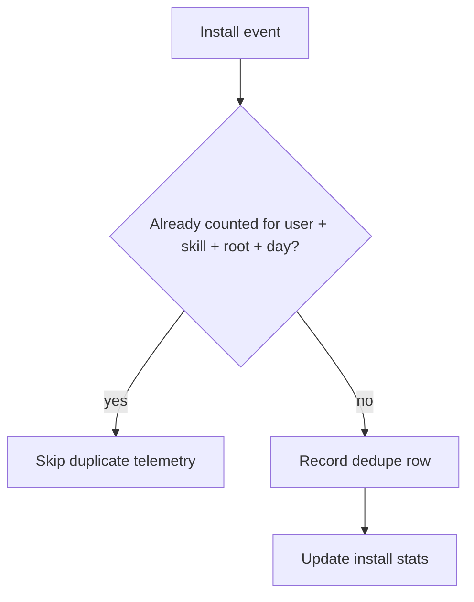
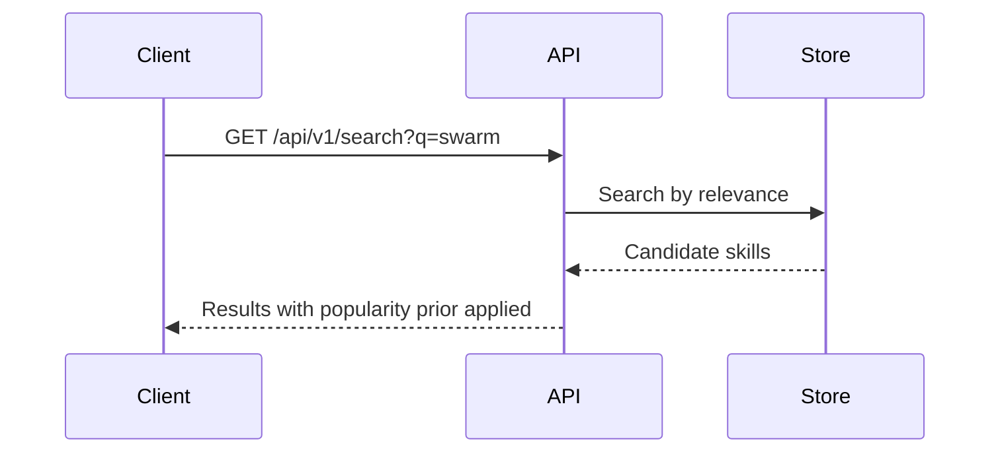

# Mermaid Proof

Use Mermaid for:

- workflows, state transitions, dedupe, cleanup, queues, crons, migrations;
- API or integration boundaries;
- permission/access decisions;
- multi-step behavior reviewers would otherwise reconstruct from code.

Keep diagrams small and useful. Prefer one clear diagram over several
decorative ones.

Before posting or updating a PR body with Mermaid:

1. Extract every `mermaid` fenced block from the final PR body.
2. Validate each block with Mermaid CLI or an equivalent parser.
3. If validation fails, fix the diagram or remove it.
4. Do not post unvalidated Mermaid.

Recommended validation command:

```text
mmdc -i /tmp/pr-proof.mmd -o /tmp/pr-proof.svg
```

If Mermaid CLI is unavailable, avoid Mermaid and use a simple text table
instead.

Prefer quoted labels when node text contains punctuation, slashes, code-like
values, or symbols. For example, use `A["/codex bind"]` instead of
`A[/codex bind]`.

Good examples:





Avoid diagrams that only restate the summary.
