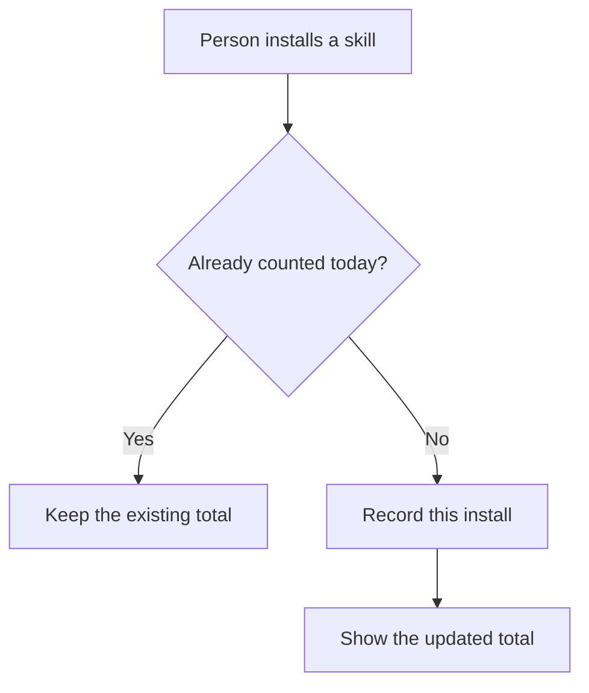

# Understandable Diagrams

Use a diagram only when it is genuinely useful teaching material for a
relationship, sequence, state transition, decision, spatial layout, comparison,
integration boundary, lifecycle, or interaction among several actors.
Having several steps or components is not enough: if a short paragraph or list
is clearer, omit the diagram.

## Make the Idea Land

Introduce the diagram with one sentence explaining what the reviewer should
learn. Then make the diagram readable without source-code context:

- start at the actor or event the reviewer recognizes;
- use short, everyday labels that describe actions and outcomes;
- introduce technical names only after the plain-language idea is clear;
- define any necessary acronym or project term in nearby text;
- show one direction of travel and one level of detail;
- keep file paths, class names, function names, and ticket IDs out unless the
  reviewer must act on them;
- prefer one small diagram over several decorative ones.

If labels no longer fit comfortably, split the idea in prose or simplify it.

## Validate Before Publishing

Before creating or updating the PR body:

1. Extract every `mermaid` fenced block from the final body.
2. Validate each block headlessly with Mermaid CLI or an equivalent parser.
3. Fix invalid syntax and unclear rendering.
4. When the body contains a Mermaid block, inspect the final rendered diagram
   through the selected interactive browser after saving. GitHub renders
   Mermaid client-side, so `body_html` exposes the code fence but cannot prove
   the diagram appeared correctly.

Recommended local validation:

```text
mmdc -i /tmp/pr-proof.mmd -o /tmp/pr-proof.svg
```

Headless validation proves syntax; the browser check proves GitHub's final
client-side rendering. If Mermaid cannot be validated, use a small plain-text
flow diagram that GitHub can render predictably. Do not post unvalidated
Mermaid. Bodies without Mermaid do not need this browser check.

Quote labels containing punctuation, slashes, code-like values, or symbols. Use
`A["Search request"]` instead of exposing a route or function name when the
human action is what matters.

Good:



Avoid diagrams that only restate the summary, list files, prove that the proof
workflow ran, make the PR look polished, or require the reader to decode
implementation vocabulary. Do not turn a simple explanation into standalone
HTML just to obtain a screenshot.
